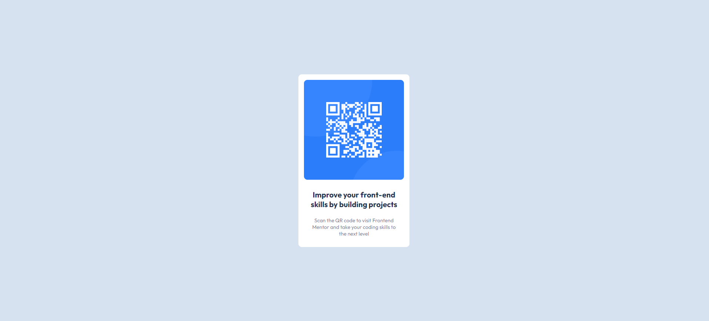

# Frontend Mentor - solução de componente de código QR
Esta é a solução para um de meus primeiros desafios no Frontend Mentor, fico aberto a qualquer crítica construtiva que possa melhorar o código e me fazer a aprender ainda mais sobre o mundo da programação.

## Visão geral

- URL da solução: [Adicione o URL da solução aqui](https://your-solution-url.com)
- URL do site ativo: [Adicione o URL do site ativo aqui](https://your-live-site-url.com)

## Meu processo
1 - Análise do Desafio: Comecei lendo cuidadosamente os requisitos do desafio e entendi o que era esperado.

2 - Estrutura HTML: Criei a estrutura básica do HTML, incluindo a área onde o código QR seria exibido.

3 - Estilização CSS: Utilizei CSS para estilizar o componente. Fiz uso de flexbox e outras propriedades para posicionar os elementos corretamente.

4 - Testes e Ajustes: Testei a solução em diferentes dispositivos e navegadores para garantir que estava funcionando corretamente. Fiz ajustes conforme necessário.

5 - Documentação: Escrevi este README para explicar minha solução, incluindo capturas de tela e links relevantes.

## Construído com

- Marcação HTML5 semântica
- Propriedades personalizadas CSS
- Flexbox e técnicas de layout responsivo

## O que eu aprendi

- Documentação e boas práticas: Ao criar meu README para o projeto, pratiquei a habilidade de documentar minha solução de forma clara e concisa. Isso é essencial para colaboração e compartilhamento de código.

## Desenvolvimento contínuo

- Acredito que com esforço e dedicação me aperfeiçoarei na construção de códigos limpos e de fácil manutenção. 
- Aperfeiçoamento na utilização de flexbox, e melhor entendimento da propriedade grid, a qual neste momento estou me dedicando a aprender. 

## Autor

- Perfil do Frontend Mentor - [@munizz-g](https://www.frontendmentor.io/profile/munizz-g)
- Linkedin - [Lucas Muniz](https://www.linkedin.com/in/lucas-muniz-gomes-36bba0298/)
